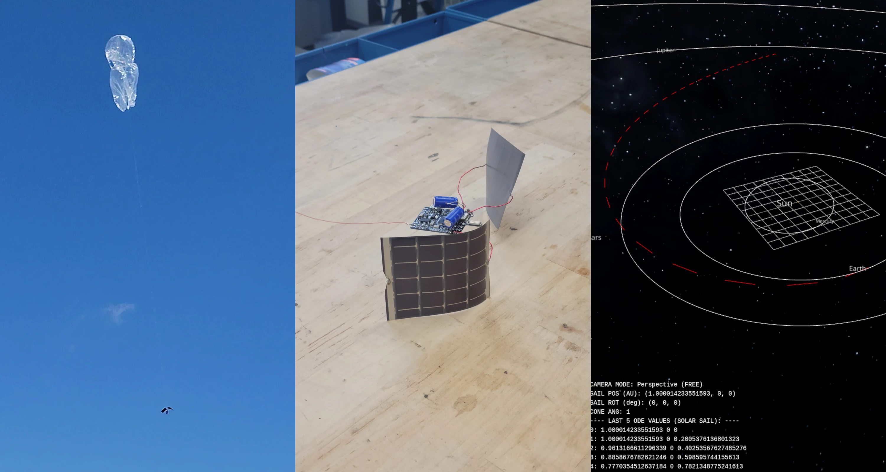
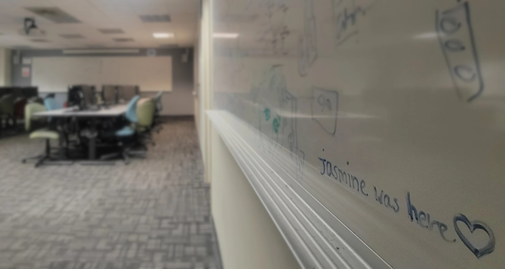
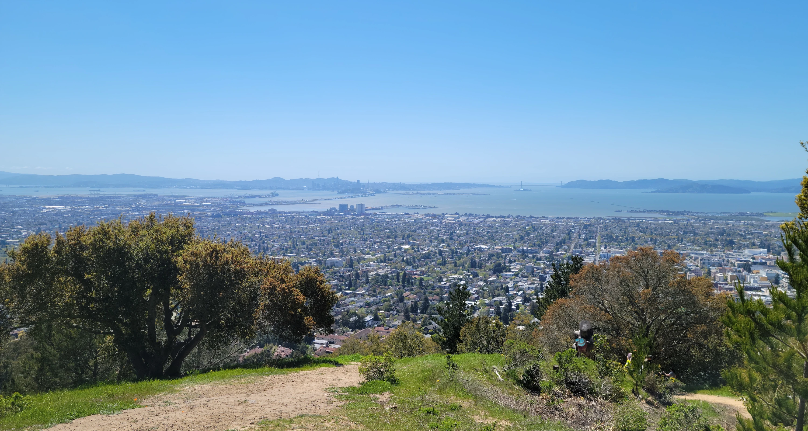
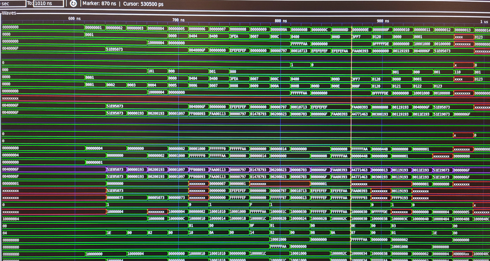

Wellll... I've had the blurbs section on my website for far too long and I've yet to use it! Ended up turning into a "one of these days" type of project. Berkeley was keeping me far too busy and I needed to update my website's layout to support it, so it was difficult to find the time to sit down and get it done. UNTIL NOW :D

Anyways, wow, four years really flew by. A lot has changed! I've met so many cool people, taught some classes, worked some internships, made some chips do some cool things, helped get a paper accepted for said chips, and now I'm at NVIDIA making even more chips do cool things. 

I would say that these were some of the most difficult years of my life. From insane work schedules to personal challenges (which I'll probably talk about more in another blurb), it really built character over the years. This blurb will just have highlights of the main pieces of advice from my Berkeley experience, saving further details for later blurbs.

## Seminars

Despite having to deal with the hectic lower division courses during my freshman year, what kept me motivated throughout were the interesting [Berkeley seminars](https://curricularconnections.berkeley.edu/freshman-and-sophomore-seminars/) offered that were tailored specifically for freshmen or sophomores. They are usually just a unit or two and very worthwhile! They are great ways to talk with instructors in a smaller class context (around 20 people) while discussing something that suits both of your interests.

In my first semester, I took the [BLISS: Berkeley Low-Cost Interplanetary Solar Sail seminar](https://www.ssl.berkeley.edu/the-bliss-project-small-solar-sails-could-be-the-next-giant-leap-for-interplanetary-space-exploration/), led by Dr. Andrew Westphal and Prof. Kris Pister. The goal: designing a ~10g spacecraft piloted using MEMS actuators to act as a low-cost method of exploring the solar system with CubeSats. This was an incredible introduction to networking with professors and understanding how research works at Berkeley.

In my second semester, I took the [Hands-On-Ham Radio seminar](https://classes.berkeley.edu/content/2022-spring-eleng-39-001-sem-001) led by Prof. Miki Lustig. Here, we launched two balloons with APRS and WSPR GPS beacons and tracked their locations as they flew across the world. In this seminar, you also work towards getting your FCC technician amateur radio license and are given a starter handheld radio. It was tons of fun messing around with SDRs and listening in to different broadcasts, plus talking on the UC Berkeley net every Wednesday was a neat experience. This is an annual tradition that is held in this seminar and is not super technical, so if you have a chance to take it, it's a great way to both get your amateur radio license and have fun launching balloons.

## Teaching

One thing I absolutely do not regret was my decision to become a teaching assistant throughout my years at Berkeley. My personal interests lean heavily towards low-level software and hardware design, thus I really enjoyed taking CS 61C (machine structures). I started teaching CS 61C as an academic intern in Spring 2023, then progressed to tutor the following semester, then a TA for two semesters afterwards. After I had taken the tapeout and bringup courses, I became a teaching assistant for the following class tapeout project in Spring 2025.

I would have started teaching other classes earlier, but due to some self-esteem issues early on, I worried that I was just not qualified to teach in any capacity. This was absolutely unjustified, however, and honestly teaching was one of the best things I had done.

TEACHING IS SO MUCH FUN!!!

It was an incredible privilege to be afforded the opportunity to teach other students in this capacity. This ended up being one of the biggest highlights of my time at Berkeley and was some of the most fun I had. I learned a ton from my peers and I would absolutely do it again. Both CS 61C and the tapeout course 

## Work-Life Balance

Preserving work-life balance at Berkeley was one of the hardest things for me to maintain. Looking back, it’s probably the biggest thing I wish I had handled differently during college, but even in the moment, I knew it was something I struggled with.

When you are thrown into an environment that is conducive to overwork, it becomes surprisingly easy to let all-nighters become routine, especially in research. In EECS, both in academics and in the lab, this was a very common theme from what I observed and experienced.

No matter how many times I would try to enforce that I keep a schedule or block out time for personal things, work would always find a way to creep back in to fill up the gaps.

I got to work on some really exciting projects, especially during the Spring 2024 bringup of the Berkeley chips. I do wish I could have regulated the time spent there a bit more, though. Entering the lab during the day, losing track of time and leaving at midnight was incredibly common and I absolutely had to set alarms to let me know when to leave.

To keep myself from molding into the shape of a chair, I was able to manage the stress by forcing myself to get outside and go on hikes or hang out with friends. Despite this, drowning in work was a terribly isolating experience. If you can, try to budget a little bit of time to a hobby of some sort. It wasn't very feasible for me to do this, but try to budget this into your schedule before it gets too hectic.

Small bit of advice if any current Berkeley students happen to be reading this: [CAPS exists](https://uhs.berkeley.edu/caps), is free, and carried me through points of intense struggle. There is no shame in using it and I would strongly recommend it.

## Spring 2023 (a cursed semester)

***Do not take EECS 151, Physics 7B, CS 70, and the HOPE DeCal at the same time. That was a really bad idea. I found myself left with close to no free time at all.***

save your sanity. preserve your hair. I'm sure I knocked like 5 years off my lifespan during that semester. For prioritizing mental health, it is genuinely not worth enduring this schedule. At the very least, take physics a different semester if you are focused on digital IC design. Having two problem-set heavy courses constantly assigning more work on top of EECS 151's final project and the HOPE DeCal project in the back of your mind at all times is not a healthy combination.

That being said, I will say that I am happy that I took EECS 151 early on (sophomore spring). This is what ultimately allowed me to be a TA for tapeout later on, while going through the tapeout/bringup course flow entirely. Sure, I could have taken the bringup course in the following fall semester, but I needed a relatively lighter semester to rest.

## What's Next?

Now that I've graduated and settled into San Jose, I'll now be able to actually pursue some hobbies I've had, which I previously didn't have time to do. Some of this does align with EECS-related things like hobbyist hardware development or DIY projects, but a lot doesn't, like sewing or language learning. Most of the future blurbs here will likely follow this trend, but other random things will be coming soon!

Until next time! :D