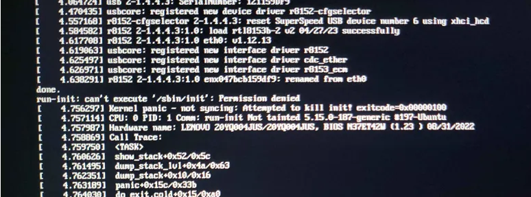
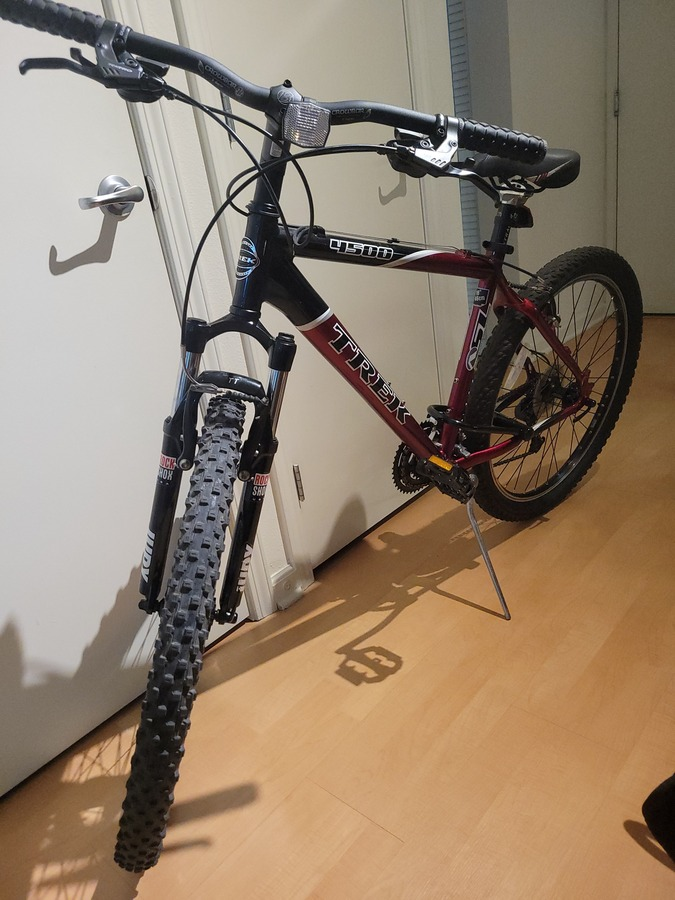

eheh the little jax :D (thanks feli) also dang my hair is goin wild in that pic

RAAAAAAAAAAAAAAHHHHHHHHHH its been too long >.< wahhhhh

Goodness gracious this year has been CRAZY thus far. All sorts of silly wacky goofy ups and downs, but I'm still kicking and doing my best! :D

## Update: my poor laptop

It seems my laptop (a.k.a., my ***ThinkPad P15 Gen 2 20YQ*** :P) has been *really* going through it. A couple years ago, I made a NixOS partition thinking "Hmm, *mayyyyybe* I should try to be one of those super nerdy Linux users that has all their cool keybinds and everything" but man when I tell you I wanted to chuck my laptop out my window, I mean it. All the time it took me to just get a single terminal to show up (mind you, I did the non-graphical install from scratch...), I just switched back over to Ubuntu and called it a day. I like my operating systems to at least be relatively operational.

Well, imagine my surprise a few weeks ago when I boot up my laptop to be greeted with this lovely message!

*Ahem...* Permission denied... to *me*??? Upon *boot*??? Can I... `sudo boot` or something??

Well, uh, turns out Windows 11 is the biggest loser of an operating system given how one of its update routines genuinely messed up my entire Ubuntu install somehow! I was checking what happened before this and the last thing I was doing was innocently minding my business dual-booting into Windows 11, which already made me want to take a shower, but geez to wage a full on war against MY LINUX... tsk tsk tsk

Anyways, after many hours of trying to debug this, typing out the hardware ID of my boot disk and the paths to vmlinuz/initrd countless times in the GRUB command line, I found out that somehow my entire `grub.cfg` and other mildly important system libraries (Linux.x86_64 seems mildly important) just turned into a whole bunch of null bytes. Fun!

Thankfully everything is still safe, but uh if anyone happens to have any tips for figuring this out, feel free to send mail with pointers. And yes, I am very much aware that the root solution here would be to just not use Windows. I want to transition to using VMs for that in the future.

So now... with only one other choice left on my laptop without having to deal with reinstalling a whole new OS...

### I am now forced to be a NixOS user.

I gotta say... now that my GNOME works (kinda, for some reason my second monitor just freezes on one picture), it is actually kinda... nice.

I don't really know what the "proper" way is to structure the nix configuration files, but I like the idea behind the flakes for individual projects. If only I had actual time to spend learning the syntax and getting acquainted with it. Before I could write any of this post, I had to get the Nix stuff [working for this website](https://github.com/jasmangle/jaswebsite/commit/1110beb700a59e7eb948c7b8e1c24f42bd7e7230), which was a mild pain and only a couple hours of my life I'll never get back. But, in that time, it did make me appreciate the flexibility that Nix has to offer for environment management.

Right now, my `/etc/nix` is literally just a git repository in its own right and I am just making verbatim changes in there. I don't have secrets management fully set up yet, so I am definitely not pushing anything up to a public repo, but at least it's starting to take shape. I see all the cool GitHub repos everyone has of their NixOS setups and uhhhhh it looks wayyy too intimidating for me right now.

## Update: bike!

Recently I ended up getting a <a href="https://bikeindex.org/bikes/3495946">nice used bike</a> (a Trek 4500) from <a href="https://www.goodkarmabikes.org/">Good Karma Bikes</a>! I haven't been on a bike since I was super tiny, so it is kinda nice to finally have one. Honestly, the idea of biking on the road kinda freaked me out for a while, but I figured starting out riding it early in the morning when it isn't too busy outside can ease me into it. Since I don't have a car, it certainly makes doing small trips around SJ much easier. I really gotta work on my leg muscles though, I'm terribly out of shape.

## Update: stress! yay! (positive)

There have indeed been times this year that have felt stressful for one reason or another, leading me down a silly spiral of negative feelings that led to restless nights, preoccupation with anxiety during the day, and all kinds of not so fun thoughts. Thankfully, everything is all good now after plenty of therapy and time to get myself back on track, though I think the biggest thing that helped for me significantly was taking a break during the day for mindfulness.

These days, in the mornings, I'll go out to a small park, sit on a bench, close my eyes, and just breathe, focusing on the feeling of my rear end pressing on the seat and letting all the sounds of nature just pass by. I started out doing the "Daily Trip" sessions by Jeff Warren on the <a href="https://www.calm.com/">Calm app</a> (no this isn't an ad, don't send me hate mail for this), since I had already been using the app for soundscapes (highly recommend for sleep) and the meditation programs were included from my insurance, though you really don't need an app for it (and I don't use it much for that nowadays). Starting the day with a nice meditation session, a good bike ride, and a nice cup of tea has helped me feel significantly more "ready" for the stressors of a typical day.

Hah, "I'm ready"... now I sound like Spongebob :P

## yup, that's a bird's eye view of what's going on

Of course, this isn't *everything* that is happening. I'll try to make more posts now that I actually have a real development environment I can type from, rather than a broken Jekyll instance that seemed to never work (and GitHub Pages, which decided to just not serve anything).

Cya! :D

